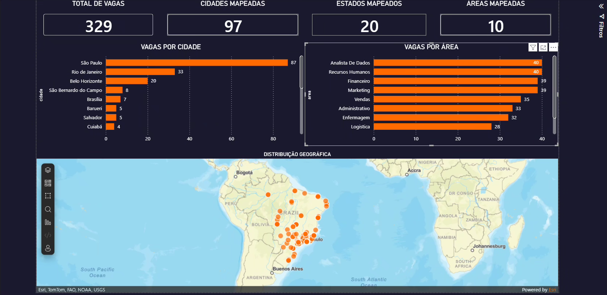

# 📊 Job Market Scraper

Coleta automatizada de vagas de emprego de 10 áreas do mercado brasileiro,
com limpeza dos dados e visualização em dashboard interativo no Power BI.



---

## 💡 Motivação

O mercado de trabalho brasileiro é amplo e diversificado, mas é difícil
ter uma visão clara de quais áreas têm mais oportunidades, quais empresas
mais contratam e como as vagas se distribuem por região.

Este projeto automatiza a coleta de vagas de 10 áreas diferentes,
transforma os dados brutos em informação estruturada e gera um dashboard
no Power BI para análise e visualização do mercado.

---

## 🎯 Objetivos

- Coletar vagas de 10 áreas diferentes do mercado brasileiro
- Extrair informações como cargo, empresa, cidade e nível
- Limpar e estruturar os dados com Pandas
- Exportar para CSV pronto para análise no Power BI
- Visualizar os dados em dashboard interativo com tema profissional

---

## 🛠️ Tecnologias

| Ferramenta | Uso |
|---|---|
| Python 3.13 | Linguagem principal |
| requests | Requisições HTTP |
| BeautifulSoup4 | Extração de dados HTML |
| pandas | Transformação dos dados |
| openpyxl | Exportação para Excel |
| Power BI | Dashboard e visualização |
| Git & GitHub | Controle de versão e portfólio |

---

## 📁 Estrutura do Projeto

```
job-market-scraper/
│
├── data/
│   ├── raw/                  # Dados brutos coletados
│   └── processed/            # Dados limpos e estruturados
│
├── src/
│   ├── scraper.py            # Coleta os dados
│   ├── cleaner.py            # Limpa e transforma
│   └── exporter.py           # Exporta para CSV/Excel
│
├── dashboard/
│   └── job_market_dashboard.pbix   # Dashboard Power BI
│
├── docs/
│   └── dashboard_preview.png       # Screenshot do dashboard
│
├── notebooks/                # Análises exploratórias
├── .gitignore
├── requirements.txt
└── README.md
```

---

## 🔄 Pipeline de Dados

```
vagas.com.br
     │
     ▼
 scraper.py              ← coleta as vagas por área
     │
     ▼
data/raw/VAGAS.csv       ← dados brutos
     │
     ▼
 cleaner.py              ← remove duplicatas, trata textos, separa cidade/estado
     │
     ▼
data/processed/          ← dados prontos
     │
     ▼
Power BI Dashboard       ← visualização interativa
```

---

## 📈 Dashboard

Dashboard construído no Power BI com tema dark orange, cobrindo:

- **329 vagas** coletadas em **10 áreas** diferentes
- **97 cidades** e **20 estados** mapeados
- Top 10 cidades por volume de vagas
- Distribuição por área de atuação
- Mapa geográfico interativo das oportunidades no Brasil

---

## ▶️ Como Executar

### Pré-requisitos
- Python 3.10 ou superior
- Git

### Passo a passo

```bash
# Clone o repositório
git clone https://github.com/LeandroBispo90/job-market-scraper.git

# Entre na pasta
cd job-market-scraper

# Crie e ative o ambiente virtual
python -m venv venv
venv\Scripts\activate  # Windows

# Instale as dependências
pip install -r requirements.txt

# Execute o scraper
python src/scraper.py

# Execute a limpeza
python src/cleaner.py
```

Abra o arquivo `dashboard/job_market_dashboard.pbix` no Power BI Desktop
e atualize a fonte de dados apontando para `data/processed/vagas_limpo.csv`.

---

## 📦 Resultados Gerados

Ao executar o projeto, serão gerados:

- `data/raw/VAGAS.csv` — dados brutos coletados
- `data/processed/vagas_limpo.csv` — dados limpos prontos para análise
- Dashboard interativo no Power BI

---

## 🔮 Próximos Passos

- [x] Expandir coleta para múltiplas áreas
- [x] Separar cidade e estado em colunas distintas
- [x] Criar dashboard no Power BI
- [x] Adicionar mais fontes de vagas
- [ ] Agendar execução automática com schedule
- [ ] Análise de frequência de skills por cargo

---

## 👤 Autor

**Leandro Bispo**

[](https://www.linkedin.com/in/leandrorbispo/)
[](https://github.com/LeandroBispo90)
